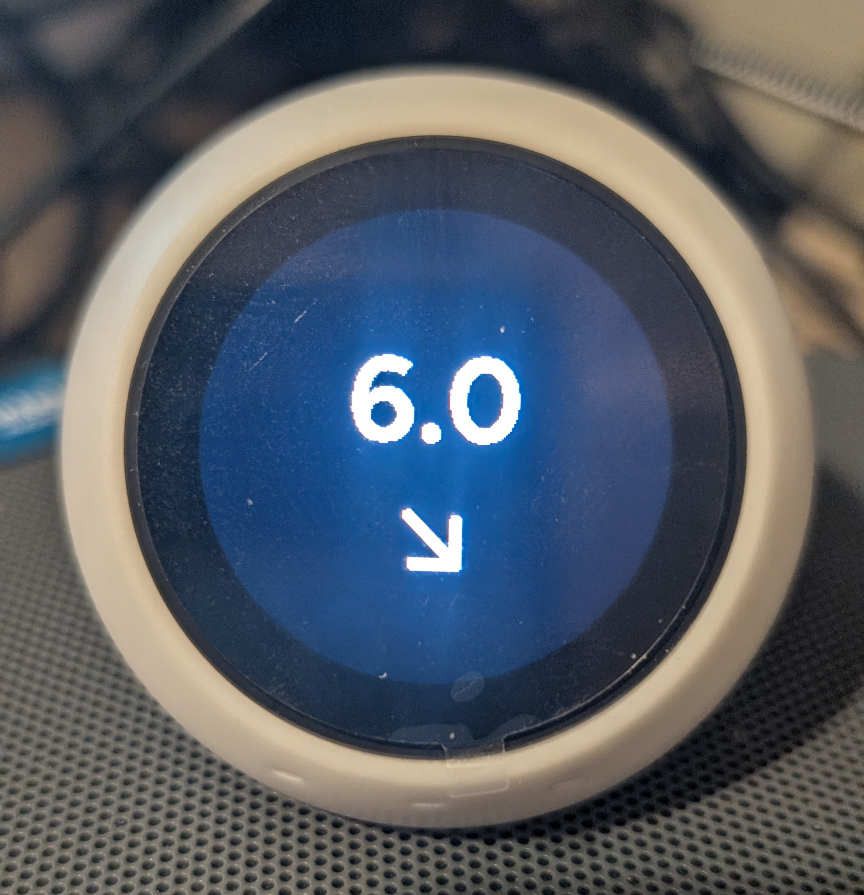

# XiaoZhi AI Voice Chat Robot Ball ESP32-S3 + Dexcom Glucose Monitor
Diabetes monitor and voice assistant for the Xiaozhi Bolita V2
# Bolita Dexcom Monitor 🩺
A custom package for the Xiaozhi "Bolita" to display real-time Dexcom glucose levels.

# 🍄 Bolita Mario Dexcom (Beta 1)

### 📸 Bolita en Acción
<p align="center">
  
  
  
  
  
</p>
---

## ⚠️ IMPORTANT: MEDICAL DISCLAIMER

**THIS PROJECT IS FOR INFORMATIONAL AND EDUCATIONAL PURPOSES ONLY.**

*   **NOT a Medical Device:** This "Bolita" display is not a replacement for the official Dexcom app or any medically approved monitoring hardware.
*   **Treatment Decisions:** NEVER make medical treatment decisions (such as insulin dosing or glucose corrections) based solely on the information displayed on this device.
*   **Mandatory Verification:** You MUST always consult your official Dexcom smartphone app or receiver for the official reading before taking any medical action.
*   **Use at Your Own Risk:** The author is not responsible for data transmission errors, network delays, or hardware failures that may result in incorrect readings.
------

## ☁️ Connectivity & Data Source

**This project requires an active Home Assistant (HA) installation to function.**

*   **Official Integration:** The data is pulled from the [Official Dexcom Integration](https://www.home-assistant.io) within Home Assistant.
*   **Cloud-Based:** Data is retrieved from **Dexcom Cloud Servers**, not directly from your smartphone or transmitter via Bluetooth.
*   **Internet Dependency:** A stable internet connection is required for both your Home Assistant server and the "Bolita" device to display real-time glucose values.
---

## ⚙️ Technical Beta Notes (Read Before Use)

**Current Version:** Beta 1

*   **Units:** This project is currently hardcoded for **mmol/L**. If your Dexcom is set to `mg/dL`, the color rings and logic **will not work correctly**.
*   **Thresholds:** The glucose color levels (Yellow/Red) are currently fixed in the YAML code. Future versions will aim to make these configurable via Home Assistant helpers.
*   **Audio Alarms:** Sound alerts and notifications are **not** managed by the ESP32 code. You must configure your automations and audio triggers directly within **Home Assistant**.
*   **Hardware:** Optimized specifically for the Xiaozhi "Bolita" V2 (S3 Box) with a round 240x240 LCD.
---

**Current Version:** Beta V1 (Optimized for **mmol/L**)

### 🎨 Glucose Color Thresholds:
The visual ring logic is currently set as follows:
- **🔴 Red Ring:** Glucose below **4.0** mmol/L.
- **🟡 Yellow Ring:** Glucose above **10.0** mmol/L.
- **🔴/🟡 Double Red/Yellow Ring:** Glucose above **14.0** mmol/L.
- **Manual Adjustments:** To change these thresholds, edit the `Ball-v2-3Mario.yaml` file around **line 1111** and modify the values manually.

### 🔊 Audio & Automation Tips:
- **Audio Alarms:** Sound notifications must be triggered via **Home Assistant automations**.
- **Important Delay:** When sending an audio alert, please add a **delay of approximately 8 seconds** before playing the alarm sound. The I2S audio driver can become congested during simultaneous display/voice tasks; this delay ensures smooth playback.
- **Units:** This logic is exclusive to `mmol/L`. If you use `mg/dL`, the thresholds will not trigger correctly.

---


### 📝 Quick Setup (3 Steps)

1. **Assets:** Place the `assets_round/` folder in your local ESPHome directory.
2. **Secrets:** Open your `secrets.yaml` and fill in your credentials exactly like this:

```yaml
# secrets.yaml
wifi_ssid: "YOUR_WIFI_NAME"
wifi_password: "YOUR_WIFI_PASSWORD"
dexcom_username: "YOUR_DEXCOM_USER"  # Example: locolucca

