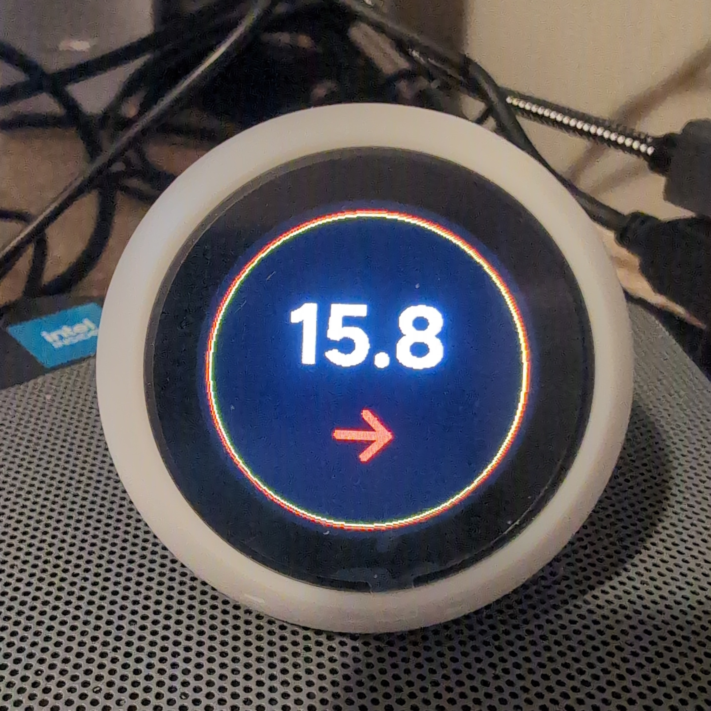
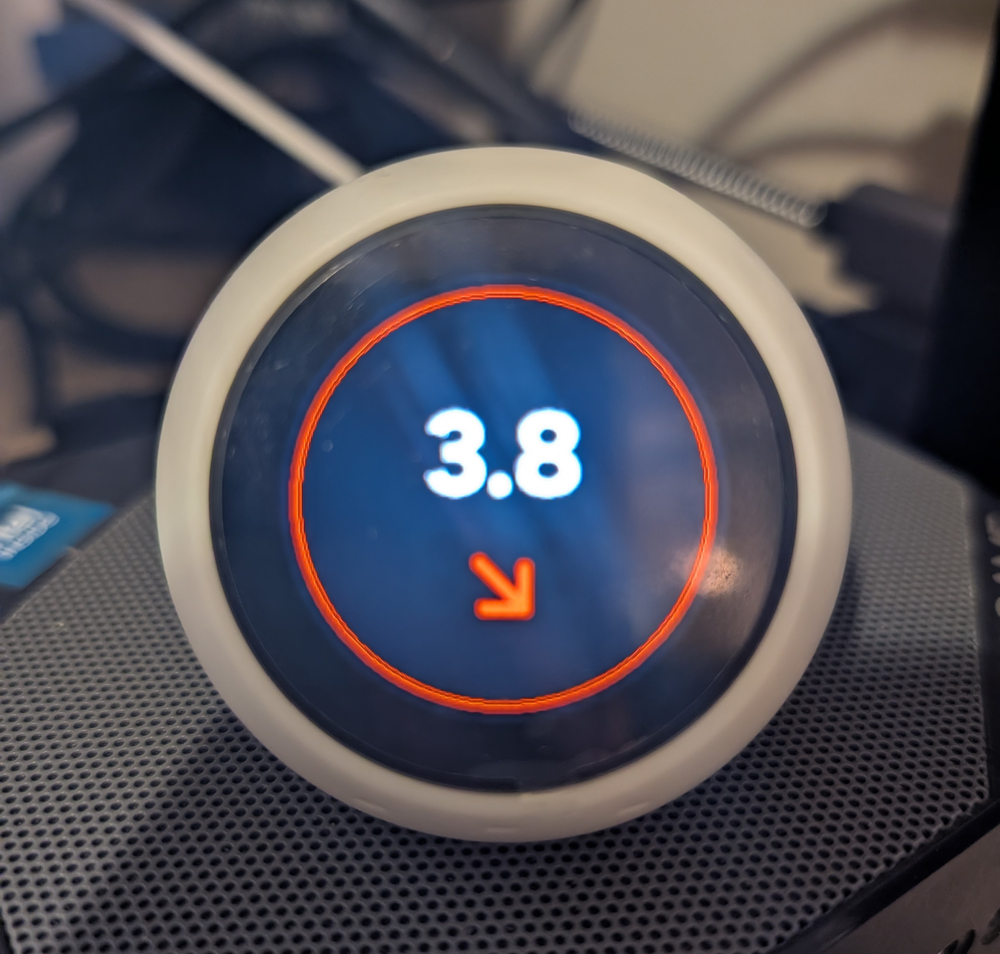
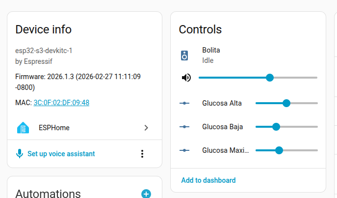

# ESPHome Assistant, XiaoZhi AI Voice Chat Robot SpecBall ESP32-S3 1.28 inch LCD N16R8 + Dexcom Glucose Monitor
Diabetes monitor and voice assistant for the Xiaozhi Bolita V2
# Bolita Dexcom Monitor 🩺
A custom package for the Xiaozhi "Bolita" to display real-time Dexcom glucose levels.

# 🍄 Bolita Mario Dexcom (V 1.0.0)

### 📸 Bolita en Acción
<p align="center">
  
  
  
  
  
  
</p>
---

## ⚠️ IMPORTANT: MEDICAL DISCLAIMER

**THIS PROJECT IS FOR INFORMATIONAL AND EDUCATIONAL PURPOSES ONLY.**

*   **NOT a Medical Device:** This "Bolita" display is not a replacement for the official Dexcom app or any medically approved monitoring hardware.
*   **Treatment Decisions:** NEVER make medical treatment decisions (such as insulin dosing or glucose corrections) based solely on the information displayed on this device.
*   **Mandatory Verification:** You MUST always consult your official Dexcom smartphone app or receiver for the official reading before taking any medical action.
*   **Use at Your Own Risk:** The author is not responsible for data transmission errors, network delays, or hardware failures that may result in incorrect readings.
------

## ☁️ Connectivity & Data Source

**This project requires an active Home Assistant (HA) installation to function.**

*   **Official Integration:** The data is pulled from the [Official Dexcom Integration](https://www.home-assistant.io) within Home Assistant.
*   **Cloud-Based:** Data is retrieved from **Dexcom Cloud Servers**, not directly from your smartphone or transmitter via Bluetooth.
*   **Internet Dependency:** A stable internet connection is required for both your Home Assistant server and the "Bolita" device to display real-time glucose values.
---

## ⚙️ Technical Beta Notes (Read Before Use)

**Current Version:** Beta 1

*   **Units:** This project is currently hardcoded for **mmol/L**. If your Dexcom is set to `mg/dL`, the color rings and logic **will not work correctly**.
*   **Thresholds:** The glucose color levels (Yellow/Red) are currently fixed in the YAML code. Future versions will aim to make these configurable via Home Assistant helpers.
*   **Audio Alarms:** Sound alerts and notifications are **not** managed by the ESP32 code. You must configure your automations and audio triggers directly within **Home Assistant**.
*   **Hardware:** Optimized specifically for the Xiaozhi "Bolita" V2 (S3 Box) with a round 240x240 LCD.
---

**Current Version:** Beta V1 (Optimized for **mmol/L**)

### 🎨 Glucose Color Thresholds:
The visual ring logic is currently set as follows:
- **🔴 Red Ring:** Glucose below **4.0** mmol/L.
- **🟡 Yellow Ring:** Glucose above **10.0** mmol/L.
- **🔴/🟡 Double Red/Yellow Ring:** Glucose above **14.0** mmol/L.
- **Manual Adjustments:** To change these thresholds, move slyders in HA card.

### 🔊 Audio & Automation Tips:
- **Audio Alarms:** Sound notifications must be triggered via **Home Assistant automations**.
- **Important Delay:** When sending an audio alert, please add a **delay of approximately 8 seconds** before playing the alarm sound. The I2S audio driver can become congested during simultaneous display/voice tasks; this delay ensures smooth playback.
- **Units:** This logic is exclusive to `mmol/L`. If you use `mg/dL`, the thresholds will not trigger correctly.

## 🚀 Features & Capabilities (The Technical Stuff)

This "Bolita" version is built on ESPHome, offering a robust and flexible alternative to commercial monitors.

### 📊 Glucose Monitoring
- **Real-Time Display:** Simple and clear glucose value with trend arrows (Steady, Rising, Falling).
- **Dynamic Color Logic:** The screen ring changes color automatically based on thresholds (Red < 4.0, Yellow > 10.0, Double Red/Yellow > 14.0 mmol/L).
- **Official Integration:** Powered by the [Home Assistant Dexcom Integration](https://www.home-assistant.io).
- **Smart Refresh:** Data is pulled from the Dexcom Cloud, ensuring your Bolita stays synced with your transmitter.

### 🎙️ Voice & Audio (Smart Assistant)
- **Voice Assistant:** Integrated with Home Assistant Assist. It hears you and speaks back!
- **Male Voice Profile:** Optimized for the **"Ryan" (Piper)** high-quality natural voice.
- **Custom Wake Word:** Supports **"Hey Mario"** or **"Computer"** via openWakeWord/Wyoming.
- **Configurable Alarms:** Sound alerts are managed via Home Assistant automations, allowing for custom volumes and snooze intervals.
- **I2S Stability:** Hardware-tuned buffers to prevent audio congestion during high-traffic updates.

### 🖼️ UI & Customization
- **Mario Themed UI:** Custom full-color icons for every state (Idle, Listening, Thinking, Error).
- **High Visibility:** 240x240 round LCD optimized for clear reading from up to 3 meters away.
- **Brightness Control:** Can be adjusted directly via Home Assistant dashboard or automations.
- **Privacy First:** All personal credentials (Wi-Fi, Dexcom user) are handled via `secrets.yaml` and never hardcoded in the main firmware.

### 📡 Connectivity & System
- **WiFi Stability:** Optimized for unified 2.4/5GHz routers (like Telus) using specific ESP32-S3 handshake logic.
- **Captive Portal:** Includes a fallback AP mode for initial Wi-Fi configuration if the main network is unreachable.
- **OTA Updates:** Supports Over-The-Air updates—no need to plug it into the computer once installed.

### 📊 Version 1.0: Dynamic Glucose Thresholds (mmol/L)
- This version introduces Dynamic Sliders in Home Assistant, allowing you to change your alert colors levels without editing the YAML code or reflashing the ball.
<p align="center">
  
</p>
- Key Features: Real-time Updates: Move the slider in Home Assistant and the Xiaozhi Ball updates its LED colors and alerts instantly.
- Optimized for mmol/L: Designed for users in Canada, the UK, and other regions using mmol/L (Standard 0.1 increments).
- Persistent Settings: Your chosen thresholds are saved on the device; if the ball restarts, it remembers your last settings.
- How to Use:
After flashing this YAML, go to your Home Assistant Dashboard.
- See the Added Entities Card Slyders in your esp32-s3-devkitc-1.
- Search for and select:
 - number.glucose_low_threshold (e.g., set to 3.9 mmol/L) less than; red ring
 - number.glucose_high_threshold (e.g., set to 10.0 mmol/L) more than; yellow ring
 - number.glucose_max_high_alarm (e.g., set to 15.0 mmol/L) more than; add a red ring to the yellow
- Slide to your preferred levels.
- The Ball's display logic will now use these live values to determine if the circles should be Red, Yellow, or Yellow/Red.
- Note: You set your voice alarm or sounds via Automations & Scenes and can be different values.
- **Note2**: Slyders are in spanish, revision 1.0.1 will be corrected.
- **Note3**: Values are in mmol/L (because I am in Canada) but will create a new swith to select US /dL V 1.1.0
- 
---


### 📝 Quick Setup (3 Steps)

1. **Assets:** Place the `assets_round/` folder in your local ESPHome directory.
2. **Secrets:** Open your `secrets.yaml` and fill in your credentials exactly like this:

```yaml
# secrets.yaml
# 1. Wi-Fi Configuration
wifi_ssid: "YOUR_WIFI_SSID"
wifi_password: "YOUR_WIFI_PASSWORD"

# 2. Dexcom user Configuration
# Replace (locolucca) with your actual Dexcom username
dexcom_username: "locolucca"

# 3. Alarm values settings in mmol/L  (red below set point) (yellow above and Yellow & Red above)
glucose_min_red: "4.0"
glucose_pre_high_yellow: "10.0"
glucose_max_alarm: "14.0"


# 4. API & OTA Configuration
# Generate your 32-byte (64-character) (if you are running ESPHome outside of your HA, you will need a api number)
# Get one api key here: https://esphome.io/components/api/ 
api_encryption_key: "YOUR_GENERATED_KEY_HERE"

# Optional: OTA Password
# ota_password: "YOUR_OTA_PASSWORD_HERE"
